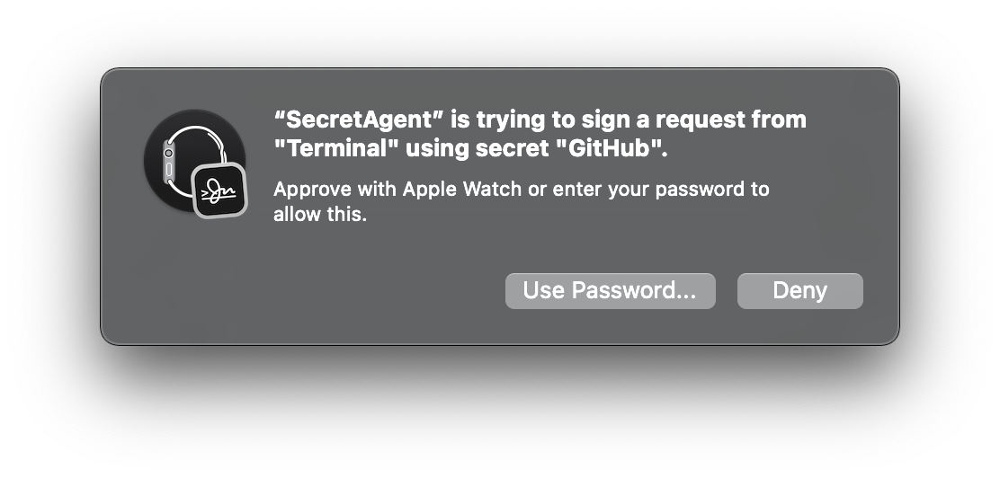

# FAQ

### How do I import my current SSH keys, or export my Secretive Keys?

The secure enclave doesn't allow import or export of private keys. For any new computer, you should just create a new set of keys. If you're using a smart card, you _might_ be able to export your private key from the vendor's software.

### Secretive doesn't work with my git client/app

Secretive relies on the `SSH_AUTH_SOCK` environment variable being respected. The `git` and `ssh` command line tools natively respect this, but third party apps may require some configuration to work. A non-exhaustive list of setup steps is provided in the [App Config FAQ](APP_CONFIG.md).

### Secretive isn't working for me

Please run `ssh -Tv git@github.com` in your terminal and paste the output in a [new GitHub issue](https://github.com/maxgoedjen/secretive/issues/new) with a description of your issue.

### Secretive was working for me, but now it has stopped

Try running the "Setup Secretive" process by clicking on "Help", then "Setup Secretive." If that doesn't work, follow the process above.

### Secretive prompts me to type my password instead of using my Apple Watch

1) Make sure you have enabled "Use your Apple Watch to unlock apps and your Mac" in System Preferences --> Security & Privacy:

2) Ensure that unlocking your Mac with Apple Watch is working (lock and unlock at least once)
3) Now you should get prompted on the watch when your key is accessed. Double click the side button to approve:

### How do I tell SSH to use a specific key?

Beginning with Secretive 2.2, every secret has an automatically generated public key file representation on disk, and the path to it is listed under "Public Key Path" in Secretive. You can specify that you want to use that key in your `~/.ssh/config`.  [This ServerFault answer](https://serverfault.com/a/295771) has more details on setting that up.

### How can I generate an RSA key?

The Mac's Secure Enclave only supports 256-bit EC keys, so inherently Secretive cannot support generating RSA keys.

### Can I use Secretive for SSH Agent Forwarding?

Yes, you can! Once you've set up Secretive, just add `ForwardAgent yes` to the hosts you want to forward to in your SSH config file. Afterwards, any use of one of your SSH keys on the remote host must be authenticated through Secretive.

### Why should I trust you?

You shouldn't, for a piece of software like this. Secretive, by design, has an auditable build process. Each build has a fully auditable build log, showing the source it was built from and a SHA of the build product. You can check the SHA of the zip you download against the SHA output in the build log (which is linked in the About window).

### I want to build Secretive from source

Awesome! Just bear in mind that because an app only has access to the keychain items that it created, if you have secrets that you created with the prebuilt version of Secretive, you'll be unable to access them using your own custom build (since you'll have changed the bundled ID).

### What's this network request to GitHub?

Secretive checks in with GitHub's releases API to check if there's a new version of Secretive available. You can audit the source code for this feature [here](https://github.com/maxgoedjen/secretive/blob/main/Sources/Packages/Sources/Brief/Updater.swift).

### How do I uninstall Secretive?

Drag Secretive.app to Trash. Check your `ps aux` output to kill any running `SecretAgent` instances. Remove the launch plist with `launchctl remove com.maxgoedjen.Secretive.SecretAgent`. Remove any Secretive Config entries in `~/.ssh/config`. Finally, restart your shell, relogin or reboot so that your prior SSH agent gets used.

### I have a security issue

Please contact [max.goedjen@gmail.com](mailto:max.goedjen@gmail.com) with a subject containing "SECRETIVE SECURITY" immediately with details, and I'll address the issue and credit you ASAP.

### I have a non-security related bug

Please file a [GitHub issue](https://github.com/maxgoedjen/secretive/issues/new) for it. I will not provide email support with the exception of the critical security issues mentioned above.

### I want to contribute to Secretive

Sweet! Please check out the [contributing guidelines](CONTRIBUTING.md) and go from there.
